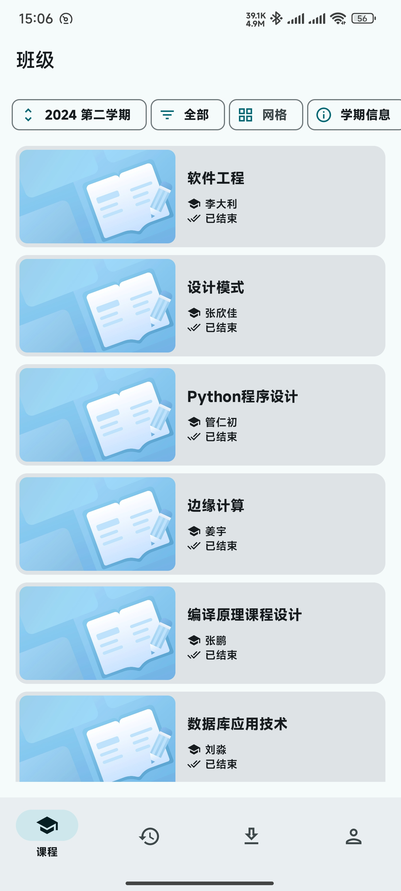
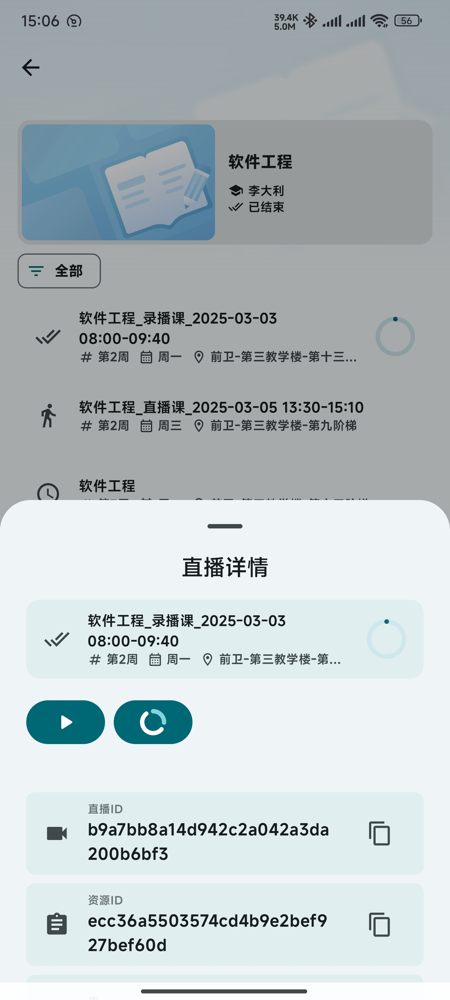
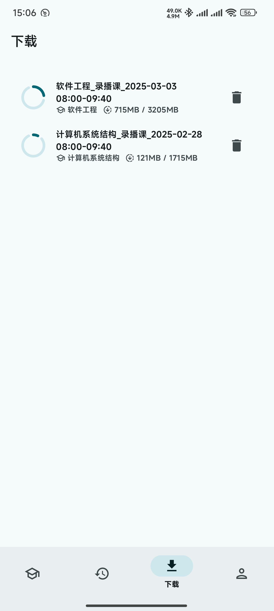
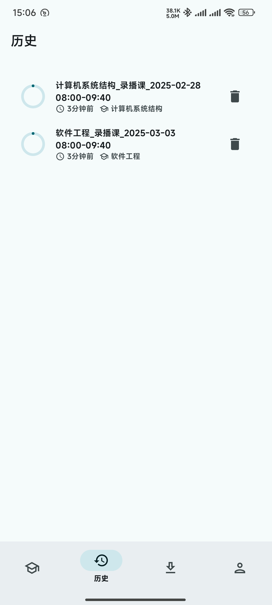
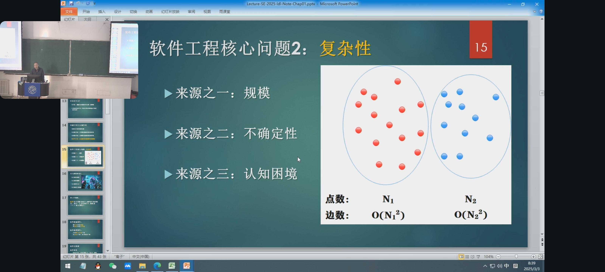
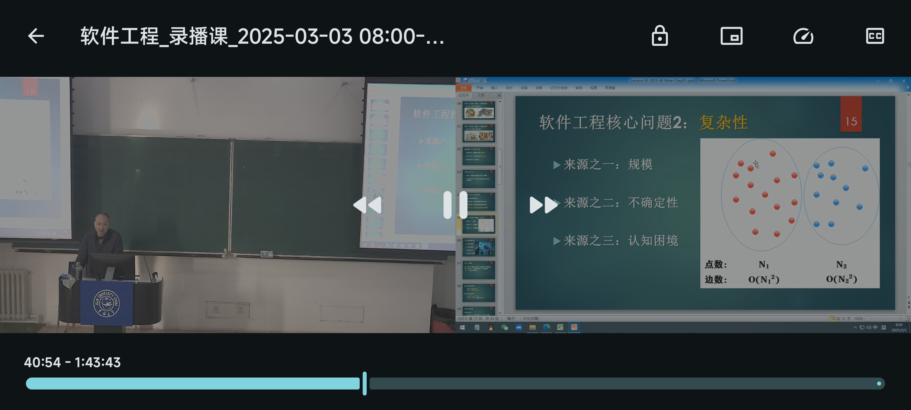

    
    <h1>ULearnTec</h1>
    
学在吉大 Android 客户端，采用 Material You 设计

### 功能/TODO

- [x] 录直播获取
- [x] 多视角平铺/小窗轮换
- [x] 字幕显示
- [x] 仿 Bilibili 播放器手势
- [x] 视频下载/播放缓存
- [x] 历史记录
- [ ] 后台 Session 刷新
- [ ] 修 Bug

### 截图

    
    
    
    
    
    

